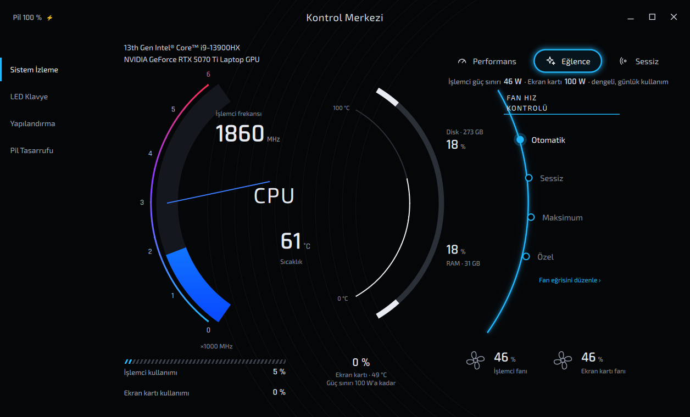
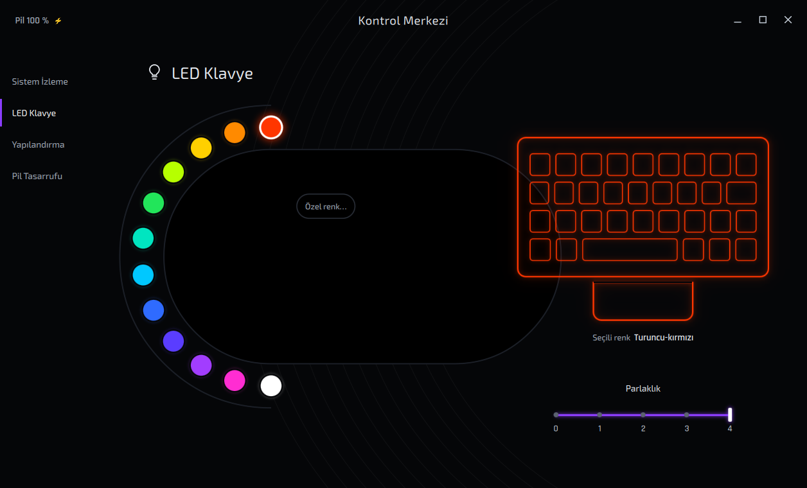
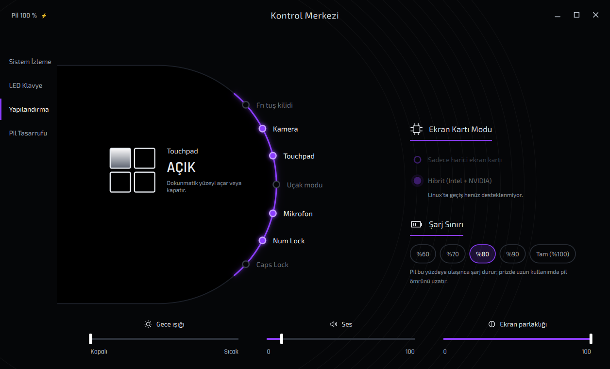
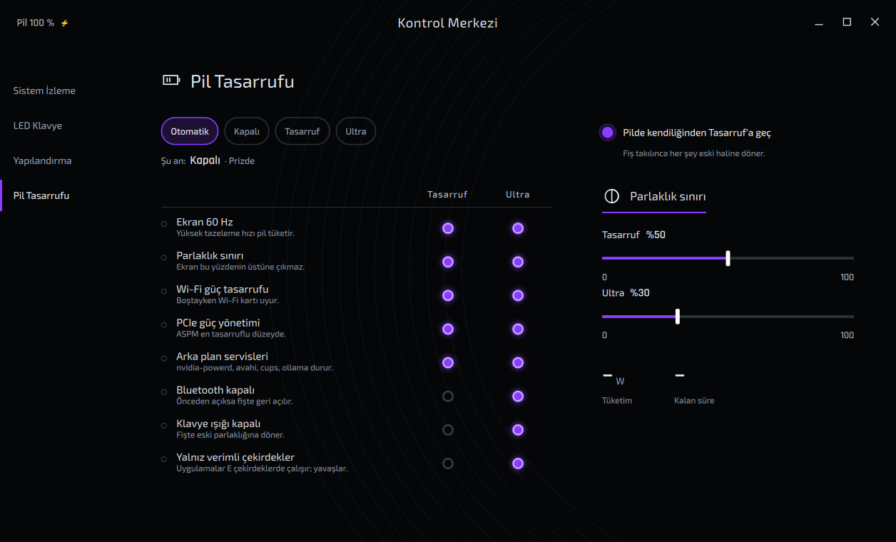
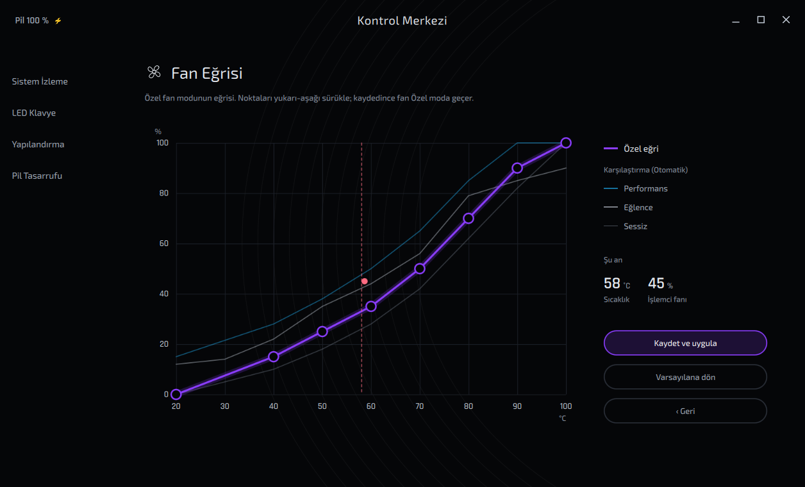
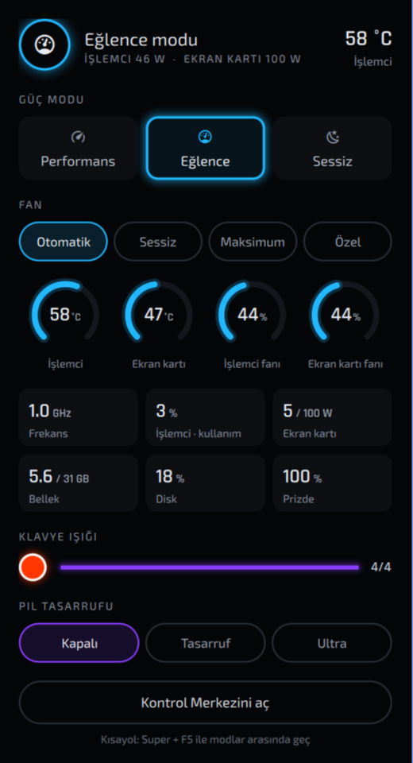

# Laptop Control Center

**Türkçe** · [English](#english)

Linux dizüstü bilgisayarlar için donanımı tanıyan bir kontrol merkezi: performans modları,
fanlar, klavye ışığı, şarj sınırı ve pil tasarrufu tek yerde. Görünümü Monster / Clevo
Control Center'dan esinlenmiştir; onlarla bir bağı yoktur.



## Neler yapar

- **Performans modları:** Performans, Eğlence, Sessiz. Her mod işlemci ve ekran kartı güç
  sınırını, işlemcinin enerji tercihini ve Otomatik fan eğrisini birlikte değiştirir.
  Örnek (Monster Tulpar T6, i9-13900HX + RTX 5070 Ti): işlemci 135 / 46 / 28 W, ekran kartı
  115 (Dynamic Boost ile 140) / 100 / 100 W.
- **Fan:** Otomatik (modun karakterinde), Sessiz, Maksimum ve sürüklenebilir noktalarla
  düzenlenen Özel eğri.
- **Canlı izleme:** işlemci frekansı, sıcaklığı ve kullanımı; ekran kartı kullanımı, sıcaklığı,
  gücü; fan hızları; bellek, disk, pil tüketimi ve kalan süre.
- **LED klavye:** renk paleti, özel renk, 5 kademeli parlaklık.
- **Pil tasarrufu:** pilde kendiliğinden açılan "Tasarruf" ve elle seçilen "Ultra" kademesi.
  Her kademenin neyi açacağını sen seçersin: ekran 60 Hz, parlaklık sınırı, Wi-Fi güç
  tasarrufu, PCIe ASPM, arka plan servislerini durdurma, Bluetooth, klavye ışığı, yalnızca
  verimli (E) çekirdekler. Fiş takılınca her şey açılmadan önceki haline döner.
- **Diğer:** şarj sınırı, Fn kilidi, kamera, touchpad, mikrofon, uçak modu, ses, ekran
  parlaklığı, gece ışığı.
- **Omarchy entegrasyonu:** bar'da mod simgesi ve canlı izleme paneli, Super+F5 ile mod
  değiştirme ve ekran göstergesi.
- Arayüz **Türkçe ve İngilizce** (sistem diline göre).

| LED Klavye | Yapılandırma |
|---|---|
|  |  |
| **Pil Tasarrufu** | **Fan Eğrisi** |
|  |  |



### Bar paneli (Omarchy)

Bar'daki mod simgesine tıklayınca açılır. Sol tık paneli açar, sağ tık mod adını
gizler/gösterir, fare tekerleği modlar arasında gezer. Panel açıkken değerler saniyede bir
güncellenir.

<br clear="right">

## Desteklenen donanım

| Arka uç | Cihazlar | Durum |
|---|---|---|
| **Clevo / TUXEDO** (tccd) | Clevo şasili dizüstüler: Monster, XMG, Schenker, TUXEDO… | Monster Tulpar T6 V3.7'de test edildi |
| **Genel Linux** | power-profiles-daemon / tuned-ppd olan her dizüstü | modlar, klavye ışığı (UPower), izleme |

ASUS, Lenovo ve diğer üreticiler için arka uçlar ileride eklenebilir. Arka uçlar
`lcc/backends/` altında; yenisini eklemek için `Backend` sınıfını uygulamak yeterli.

Clevo cihazlarda [TUXEDO Control Center](https://github.com/tuxedocomputers/tuxedo-control-center)
servisi (tccd) gerekir. Resmi `tuxedo-drivers` yalnızca TUXEDO markalı cihazları kabul eder;
Monster gibi diğer Clevo'lar için `clevo-drivers-dkms-git` (AUR) kullanılır. Kurulum betiği
bunu WMI kimliğinden kendisi anlar.

## Kurulum

```bash
git clone https://github.com/OWNER/laptop-control-center
cd laptop-control-center
./install.sh --dry-run   # önce ne yapacağını gör (hiçbir şeyi değiştirmez)
./install.sh
```

Betik dağıtımı (Arch, Debian/Ubuntu, Fedora), donanımı ve masaüstünü algılar. Her root
adımından önce sorar. Tekrar çalıştırmak güvenlidir; güncellemek için `git pull && ./install.sh`.

| Seçenek | |
|---|---|
| `--dry-run` | yapılacakları gösterir, değiştirmez |
| `--yes` | soru sormadan varsayılanlarla ilerler |
| `--dev` | dosyaları kopyalamak yerine depodan çalıştırır (geliştirme için) |
| `--uninstall` | kaldırır; ayarlar `~/.config/laptop-control-center` içinde kalır |

Gereksinimler: Python ≥ 3.10, PyGObject, PySide6 (pencere için), systemd, polkit. Arch
paketleri: `python-gobject pyside6 iw brightnessctl polkit`.

## Kullanım

- **Pencere:** `lcc gui` ya da uygulama menüsünde "Kontrol Merkezi".
  Ctrl+1…4 sayfalar arasında geçer, Esc kapatır.
- **Komut satırı:**

```bash
lcc status                 # donanım ve durum özeti
lcc mode performance       # performance | balanced | quiet | next
lcc fan auto               # auto | silent | max | custom
lcc kbd -b 50 -p -c ff3600 # klavye ışığı: %50, turuncu
lcc charge 80              # şarj sınırı
lcc power ultra            # pil tasarrufu: auto | off | saver | ultra
lcc monitor                # terminalde canlı izleme
```

## Nasıl çalışır

- **`lcc` (Python):** donanımı algılar ve uygun arka ucu seçer. Clevo'da tccd'ye DBus ile
  `lcc-<mod>-<fan>` profilleri yazar (`lcc setup`) ve geçici profil olarak seçer.
- **`lcc-daemon` (kullanıcı servisi):** fiş takılıp çekilince seçili modu yeniden uygular
  (tccd güç kaynağı değişince profili sıfırlar) ve pil tasarrufu kademesini yönetir.
- **`lcc-helper` (root):** pkexec ile çalışan küçük bir betik. Yalnızca sabit bir komut
  listesini kabul eder: ASPM, Wi-Fi güç tasarrufu, izin verilen servisler, rfkill, kamera,
  çekirdek kısıtlama, tccd profilleri. polkit kuralı `wheel` grubuna parolasız izin verir.
  Kaynağı: [`data/helper/lcc-helper`](data/helper/lcc-helper).
- **Arayüz:** PySide6 + QML. Ölçümler ayrı iş parçacığında yapılır, böylece pencere
  takılmaz. Bar eklentisi Quickshell (Omarchy kabuğu) içinde çalışır ve veriyi `lcc bar`
  komutundan alır.

## Lisans

[GPL-3.0-or-later](LICENSE). Yazı tipleri: Exo 2 ve Rajdhani, SIL Open Font License
(`lcc/gui/fonts/`).

Monster, Clevo ve TUXEDO kendi sahiplerinin markalarıdır. Bu proje onlarla bağlantılı
değildir ve onlar tarafından desteklenmez.

---

<a id="english"></a>

# Laptop Control Center (English)

A hardware-aware control center for Linux laptops: performance modes, fans, keyboard
backlight, charge limit and power saving in one place. The look is inspired by the
Monster / Clevo Control Center; the project is not affiliated with either.

## Features

- **Performance modes** (Performance, Entertainment, Quiet) change the CPU and GPU power
  limits, the CPU energy preference and the Automatic fan curve together.
- **Fans:** Automatic (per-mode curve), Silent, Maximum and a Custom curve edited by
  dragging points.
- **Live monitoring** of CPU, GPU, fans, memory, disk and battery.
- **RGB keyboard:** palette, custom color, 5 brightness levels.
- **Power saving:** "Saver" turns on automatically on battery, "Ultra" can be chosen by
  hand. You choose what each level does: 60 Hz display, brightness cap, Wi-Fi power save,
  PCIe ASPM, stopping background services, Bluetooth, keyboard light, efficiency cores only.
  Everything is restored when plugged in.
- **Other:** charge limit, Fn lock, camera, touchpad, microphone, airplane mode, volume,
  brightness, night light.
- **Omarchy integration:** bar widget with a live panel, Super+F5 mode cycling with an OSD.
- **Turkish and English** UI, following the system language.

## Supported hardware

Clevo-based laptops via the TUXEDO Control Center daemon (tccd); tested on a Monster
Tulpar T6 V3.7. Any laptop with power-profiles-daemon gets the generic backend. Non-TUXEDO
Clevo machines need `clevo-drivers-dkms-git` instead of `tuxedo-drivers`; the installer
detects this from the WMI GUIDs.

## Install

```bash
git clone https://github.com/OWNER/laptop-control-center
cd laptop-control-center
./install.sh --dry-run   # show what would be done
./install.sh
```

Options: `--dry-run`, `--yes`, `--dev` (run from the repository), `--uninstall`.
Re-running the installer is safe and updates an existing installation.

## Usage

`lcc gui` opens the window ("Control Center" in the app menu). See `lcc --help` for the
command line: `lcc mode performance`, `lcc fan custom`, `lcc power ultra`, `lcc status`.

## How it works

`lcc` (Python) detects the hardware and picks a backend. `lcc-daemon` is a user service
that re-applies the selected mode when the power source changes and manages power saving.
`lcc-helper` is a small root script run through pkexec that only accepts a fixed set of
commands; a polkit rule lets the `wheel` group run it without a password. The UI is
PySide6/QML; the bar widget runs inside Quickshell (Omarchy shell).

## License

[GPL-3.0-or-later](LICENSE). Fonts: Exo 2 and Rajdhani under the SIL Open Font License.
Monster, Clevo and TUXEDO are trademarks of their respective owners.
